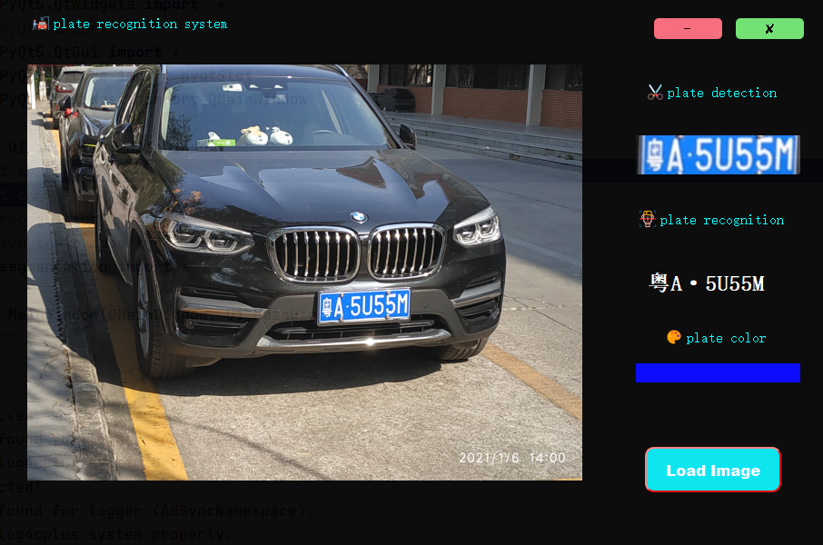

# 1. 源程序相关文件介绍

(1)**main.py**：程序的入口，运行此py文件进行车牌的剪切和识别；

(2)**segementation.py**: 实现车牌的分割；

(3)**recognition.py**:  对车牌进行字符分割和字符识别，得到最终的车牌号码；

(4)**svm_train**: SVM分类器，用于对车牌字符的预测；

(5)**UI.py**:  GUI界面的部件。

# 2.界面的使用说明

   (1) **源文件所在的计算机绝对路径不能有中文，否则会报错!**

   (2) **运行main.py 文件，得到下面的界面图；**

（3）**点击界面中的<kbd>Load Image</kbd>按钮加载并运行图像，就可以显示车牌的剪切以及识别结果。**

